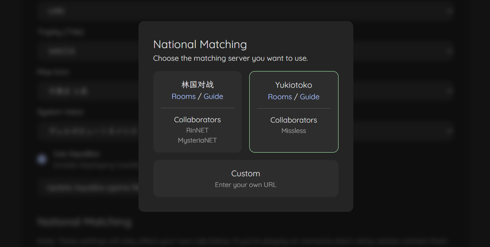
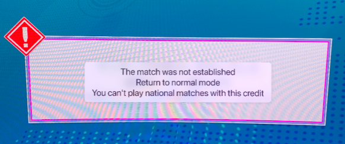

# Chunithm National Matching Guide

The national matching game mode allows up to 4 players on any server (YES, ANY SERVER) to play together.
In this game mode, for example, you can play with RinNET or Missless players as well.
This is a guide on how to set up your client for national matching.

This is tested on Chusan 2.27.

## Pre-requisites

- Play the normal game at least once so that you have a profile on the server.
- NAT Type must not be Symmetric ([Check here](https://www.checkmynat.com/))
- Your firewall must be turned off (or [add a rule that allows chusanApp](#firewall-rules))

## Setting Up



1. Go to the AquaNet website and set your matching server to "Yukiotoko"  
   (To go to the settings page, click on the gear icon in the top right corner of your profile, switch to chuni tab, scroll down, click "Select Matching Server")
2. Make sure you use [Dniel97's open-source segatools](https://gitea.tendokyu.moe/Dniel97/SEGAguide/wiki/SDHD)  
   If you're using fufubot segatools, please override it with Dniel97's version (don't forget to update `segatools.ini`).
3. Patch your `chusanApp.exe` using [Two-Torial's open-source patcher](https://patcher.two-torial.xyz/)  
   (Make sure you disable "Set all timer to 999", enable "No encryption", "No TLS", "Patch for head-to-head play")
4. Add the option [ARRR](https://pixeldrain.com/u/D2jjN3of).  
   If you're playing with friends, make sure they have the same options as you.
5. Pet your cat 🐈
6. Launch!


### Firewall Rules

Below is a simple command to add firewall rules for Chunithm.
(Put this into a text file and change the file extension to .bat)

```shell
@echo off
set /p gamedirectory = Make sure this is run as admin and enter game path (e.g. C:\SegaGames\Chunithm\bin\chusanApp.exe)\n
netsh advfirewall firewall add rule name="Chunithm National Matching Inbound" dir=in action=allow profile=any program="%gamedirectory%" enable=yes
netsh advfirewall firewall add rule name="Chunithm National Matching Outbound" dir=out action=allow profile=any program="%gamedirectory%" enable=yes
```

## Troubleshooting

**Q: Matching server BAD on network check**

Make sure you have selected "Yukiotoko" as your matching server. 
Also double check if the keychip in your segatools.ini is the same as the keychip on your account 
(since game settings are saved by keychip, it won't apply if you start the game with the wrong keychip).

Also check if you can access Yuki's [website](http://yukiotoko.chara.lol/), if you can't, 
that's probably an internet connectivity issue that's unrelated to the game.

**Q: Online battle icon gray and says "cabinet too old"**

Make sure you have played the game at least once after an update or change in options.
This is because the server-returned data version must match your game's data version for matching to work, 
and the server will return the version code your game last played with.
So if you haven't played or if you have updated your game,
you last version code would not match your current game's version until you play a game.

After playing a coin, restart the game and check if the option is available.

**Q: Online battle icon gray and says "Unable to select after the event time"**

Make sure your time zone is set to JST (UTC+9).

**Q: Game crashes when entering match mode**

Make sure you are using Dniel97's segatools.

Also, some unofficial options might cause issues. Options that have been tested to work are `ARRR`, `AOMN`, `ATUY`, `AUBC`. 
If you have options not in this list, maybe try removing them.

**Q: After matching, timer shows 999 seconds and nobody can start**

Make sure you have patched your `chusanApp.exe` correctly (especially the "Set all timer to 999" option should be disabled).

**Q: This window show up when joining.**



If there is only one player, then yea it's because there are not enough players.
Otherwise, it's because one of the players has a bad network environment (e.g. Symmetric NAT).
Try again with someone who played this mode before, if it still doesn't work, then it's probably you.

**Q: Why did I play two of the same songs in a row?**

When other people picked a song that you don't have, the game will play the same song as the previous one.
Make sure you have up-to-date options in your game. 
(Or they might have selected a custom chart, in that case there's not much you can do)

## How to Play

When you enter the matching mode, it will assign to you a matching room if other people are online, or create a new room otherwise. 
Then, after four people are present or after a specific amount of time has passed, the game will start.
Everyone will be asked to pick a song at the start, even though your song might not be the first one to be played.
After songs are picked, other players will play the song on the SAME DIFFICULTY as what you picked.
(So be a nice person and don't pick 15 if there are new players alright? 🥺)

If there are less than 4 players when the timer runs out, the game will fill in the empty slots with bots.
The bots will randomly select a song (mostly under Lv10).
